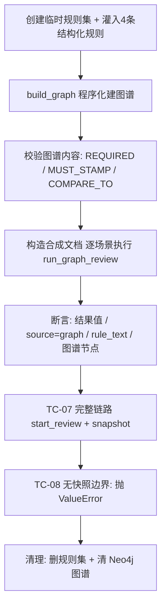

# 图谱规则自动测试（最简测试集）

## 目的

验证系统**是否正确调用图谱规则对文档进行检查**：规则经图谱构建后写入 Neo4j，
审查时按三类图谱关系（REQUIRED / MUST_STAMP / COMPARE_TO）驱动文档检查，
而不是 fallback 到旧逻辑。

本测试集刻意做到**最简且确定性**：

- 4 条结构化规则，覆盖图谱全部三类关系；图谱构建走程序化转换，**不依赖 LLM**；
- 文档为合成文档（`extracted_fields` 直接预设、`ocr_status=done`），**跳过 OCR**；
- 每次运行创建临时规则集与独立 `graph_id`，跑完自动清理（PG 级联删除 + Neo4j 清图），可重复运行。

## 测试集内容（tests/minimal_test_set.py）

### 规则（4 条）

| 检查项 | 文件类型 | 规则 | 图谱关系 |
| --- | --- | --- | --- |
| 齐套性 | 出口报关单 | 缺失必备文件则不通过 | `REQUIRED` |
| 基础判断 | 代理协议 | 未检测到印章则不通过 | `MUST_STAMP` |
| 信息准确性 | 出口报关单 | 报关单总价 = 委托单金额（容差 5%） | `COMPARE_TO`（总额等于） |
| 时间逻辑 | 出口报关单 | 委托单签订日期不晚于报关单申报日期 | `COMPARE_TO`（时间不晚于） |

### 场景（TC-01 ~ TC-08）

| 编号 | 场景 | 验证点 |
| --- | --- | --- |
| TC-01 | 文档齐全、字段一致、有印章、日期有序 | 四类图谱规则全部 pass |
| TC-02 | 缺失出口报关单 | 齐套性 fail；缺字段比对转 unverifiable |
| TC-03 | 代理协议无印章 | 基础判断 fail |
| TC-04 | 总价偏差 20%（超容差 5%） | 信息准确性 fail |
| TC-05 | 申报日期早于签订日期 | 时间逻辑 fail |
| TC-06 | 委托单金额字段缺失 | 信息准确性 unverifiable |
| TC-07 | 走完整链路 `review_service.start_review(snapshot)` | 链路确实调用图谱规则，结果全部 `source="graph"` |
| TC-08 | 无图谱快照的规则集 | 图谱审查入口抛 ValueError（不静默走旧逻辑） |

## 自动测试流程



运行器为 `tests/run_graph_rule_tests.py`（纯标准库，无第三方测试依赖）。

## 运行方式

前置条件：Postgres 与 Neo4j 已启动（配置见 `backend/.env`），无需启动后端服务。

```bat
backend\.venv\Scripts\python.exe tests\run_graph_rule_tests.py
```

或双击 `tests\run_graph_rule_tests.bat`。

退出码：0 = 全部通过，1 = 存在失败断言。

## 断言覆盖（验证"图谱规则被正确调用"）

每条图谱结果必须同时满足：

1. `result` 与期望一致（pass / fail / unverifiable）；
2. `source == "graph"` —— 证明来自图谱引擎而非旧逻辑 / LLM；
3. `rule_text` 与图谱关系属性一致；
4. `rule_id is None` —— 图谱路径不绑定 PG 规则 id；
5. COMPARE_TO 结果携带正确的 `graph_source` / `graph_target` 节点名；
6. pass → `status=closed`，fail/unverifiable → `status=open`；
7. 全场景无任何非 graph 来源结果混入。

## 扩展方式

1. 在 `minimal_test_set.py` 的 `RULES` 增加规则（COMPARE_TO 算子支持：
   等于 / 不大于 / 不小于 / 时间早于 / 时间不晚于 / 总额等于 / 包含于）；
2. 在 `SCENARIOS` 增加一个场景（文档规格 + 以 check_category 为键的期望结果）；
3. 运行脚本，无需改动运行器。

> 说明：本测试集聚焦"图谱规则是否正确被调用"，不覆盖 OCR、LLM 语义审查、
> 旧逻辑 fallback 的完整行为（由仓库根目录 `acceptance_run.py` 等端到端验收脚本覆盖）。
